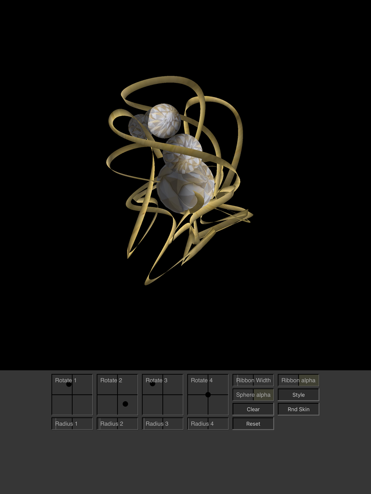

# SpirographBalls
Balls rolling upon each other define the path for 3D spirograph ribbon, \
for iPad via Swift 4 and Metal.

* All the widget boxes work the same way:
  Press and hold to either side of center to affect the parameter \
  in the specified direction and speed.

* Double Tap on a widget to toggle fast vs. slow parameter control. \
  (red vs. green background shows  fast vs. slow).

* Pinch image for zoom, 1 finger swipe to rotate.
* Tap image to stop rotation.

